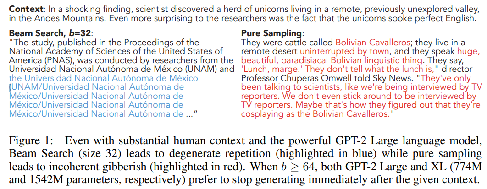
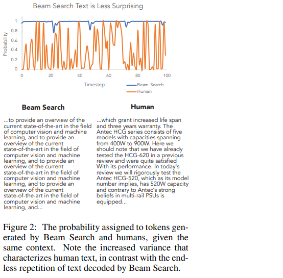
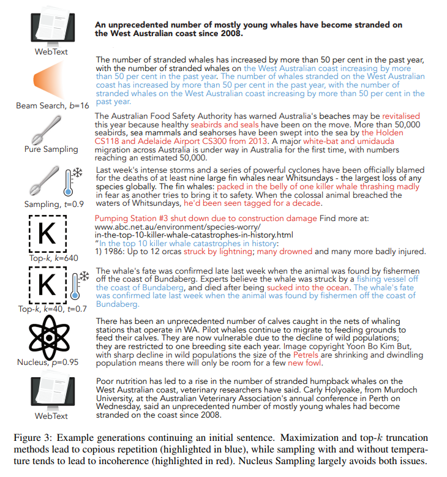
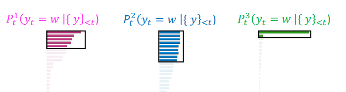
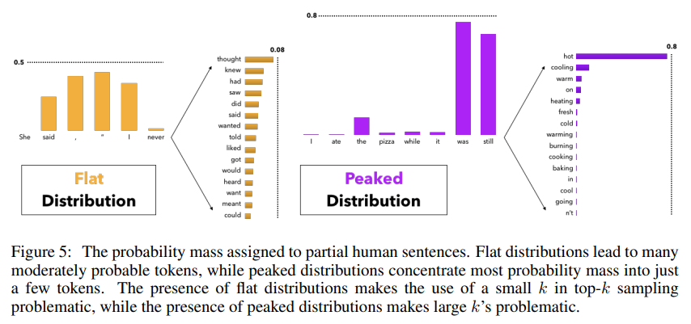
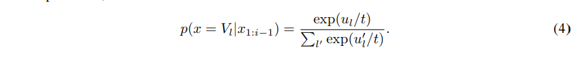
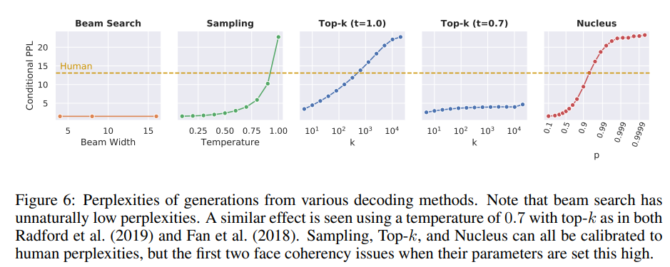
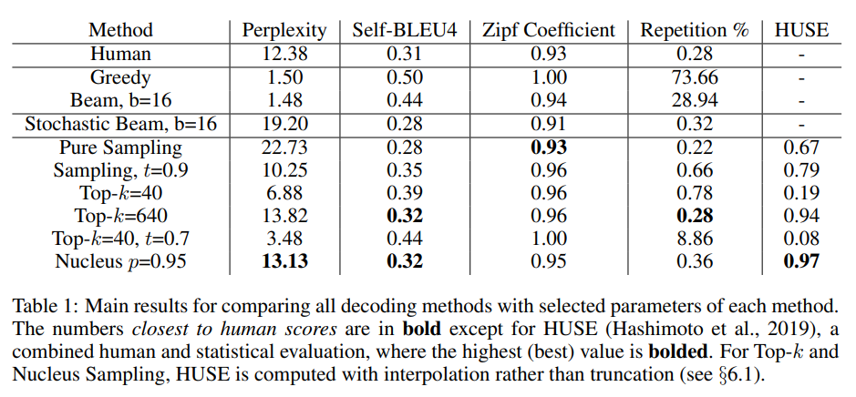
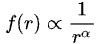

# THE CURIOUS CASE OF NEURAL TEXT DeGENERATION
###### tags: Published as a conference paper at ICLR 2020

## ABSTRACT
The counter-intuitive empirical observation is that even though the use of likelihood as training objective leads to high quality models for a broad range of language understanding tasks, maximization-based decoding methods such as beam search lead to **degeneration** — output text that is bland, incoherent, or gets stuck in repetitive loops.

To address this we propose **Nucleus Sampling**, a simple but effective method to draw considerably higher quality text out of neural language models than previous decoding strategies.

Our approach avoids text degeneration by ~~truncating the unreliable tail~~ of the probability distribution, sampling from the dynamic nucleus of tokens **containing the vast majority** of the probability mass.

## OBSERVATION
To properly examine current maximization-based and stochastic decoding methods, we compare generations from each of these methods to the distribution of human text along several axes such as **likelihood**, **diversity**, and **repetition**. Our results show that:
(1) ~~maximization~~ is an inappropriate decoding objective for openended text generation, 
(2) the probability distributions of the best current language models have an ~~unreliable tail~~ which needs to be truncated during generation and 
(3) **Nucleus Sampling** is currently the best available decoding strategy for generating **long-form text** that is both high-quality — as measured by human evaluation — and as diverse as **human-written** text.

Indeed, language models do generally assign high scores to well-formed text, yet the highest scores for longer texts are often generic, repetitive, and awkward.Figure 2 exposes how different the distribution of probabilities assigned to beam search decoded text and naturally occurring text really are.

We include generated examples for qualitative analysis – see Figure 3 for a representative example.

## NUCLEUS SAMPLING
The key idea is to use the shape of the probability distribution to determine the set of tokens to be sampled from. Given a distribution $P(x|x_{1:i−1})$, we define its top-p vocabulary $V (p) ⊂ V$ as the smallest set such that:

Let $p_{0} = \sum_{x∈V(p)} P(x|x_{1:i−1})$. The original distribution is re-scaled to a new distribution, from which the next word is sampled:

In practice this means selecting the highest probability tokens whose cumulative probability mass exceeds the pre-chosen threshold $p$. The size of the sampling set will adjust dynamically based on the shape of the probability distribution at each time step. For high values of $p$, this is a small subset of vocabulary that takes up vast majority of the probability mass — the nucleus.

##  TOP-k SAMPLING
Difficulty in choosing a suitable value of $k$. As illustrated on the left of Figure 5, in some contexts the head of the next word distribution can be flat across tens or hundreds of reasonable options (e.g. nouns or verbs in generic contexts), while in other contexts most of the probability mass is concentrated in one or a small number of tokens, as on the right of the figure.

**Under Nucleus Sampling, the number of candidates considered rises and falls dynamically**, corresponding to the changes in the model’s confidence region over the vocabulary which top-$k$ sampling fails to capture for any one choice of $k$.

## SAMPLING WITH TEMPERATURE
Temperature sampling has been applied widely to text generation. Given the logits $u_{1:|V |}$ and temperature $t$, the softmax is re-estimated as

- Raise the temperature $t > 1$ : $P_{t}$ becomes more uniform. More diverse output (probability is spread around vocab)
- Lower the temperature $t < 1$: $P_{t}$ becomes more spiky. Less diverse output (probability is concentrated on top words)

## LIKELIHOOD EVALUATION
#### EXPERIMENTAL SETUP
- In this study we use the Generatively Pre-trained Transformer, version 2 (GPT2; Radford et al., 2019), 
- which was trained on WebText, a 40GB collection of text scraped from the web. - We perform experiments using the Large model (762M parameters). 
- Our analysis is based on generating 5,000 text passages, which end upon reaching an end-of-document token or a maximum length of 200 tokens.

#### PERPLEXITY
Our first evaluation is to compute the perplexity of generated text using various decoding strategies, according to the model that is being generated from.

>**Zipf's law** is an empirical law formulated using mathematical statistics that refers to the fact that for many types of data studied in the physical and social sciences, the rank-frequency distribution is an inverse relation. 

e.g. 最高的頻率出現的頻率是出現頻率第二位的頻率的兩倍，而頻率頻率第二位的頻率則是出現頻率頻率第四位的頻率的兩倍

>**HUSE** is computed by training a discriminator to distinguish between text drawn from the human and model distributions, based on only two features: The probability assigned by the language model, and human judgements of typicality of generations. Text that is close to the human distribution in terms of quality and diversity should perform well on both likelihood evaluation and human judgements.

## Conclution
- This paper provided a deep analysis into the properties of the most common decoding methods for open-ended language generation. 
- We have shown that likelihood maximizing decoding causes **repetition** and **overly generic language usage**, while sampling methods without truncation **risk sampling from the low-confidence tail** of a model’s predicted distribution.
- Further, we proposed **Nucleus Sampling** as a solution that captures the region of confidence of language models effectively.